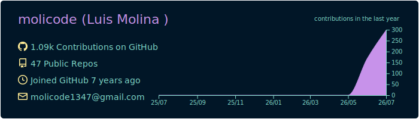
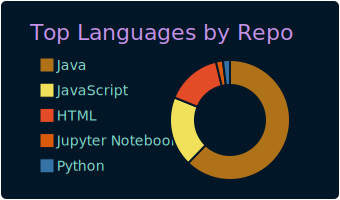
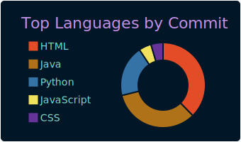
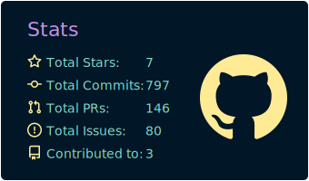
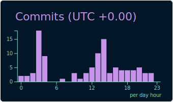

<h1 align="center">Hi there, I'm Luis Molina 👋</h1>

  ⚡ Software Engineer · Tech enthusiast · Lifelong learner

  
  
  

---

### 👨‍💻 About me

I'm a software engineer passionate about building innovative, high-impact software grounded in best practices. I love learning new programming languages and frameworks, and I enjoy problem solving, photography, and reading.

- 🔭 Always working on something new and learning along the way
- 🌱 Currently deepening my skills in Java and modern software engineering practices
- 💬 Ask me about backend development, clean code, and algorithms
- 📫 Reach me on [LinkedIn](https://linkedin.com/in/molicode)

---

### 🛠️ Tech Stack

---

### 📊 GitHub Stats

  
  

  

#### Profile summary

  

  
  

  
  

---

  <i>Thanks for stopping by — feel free to explore my repositories!</i>

